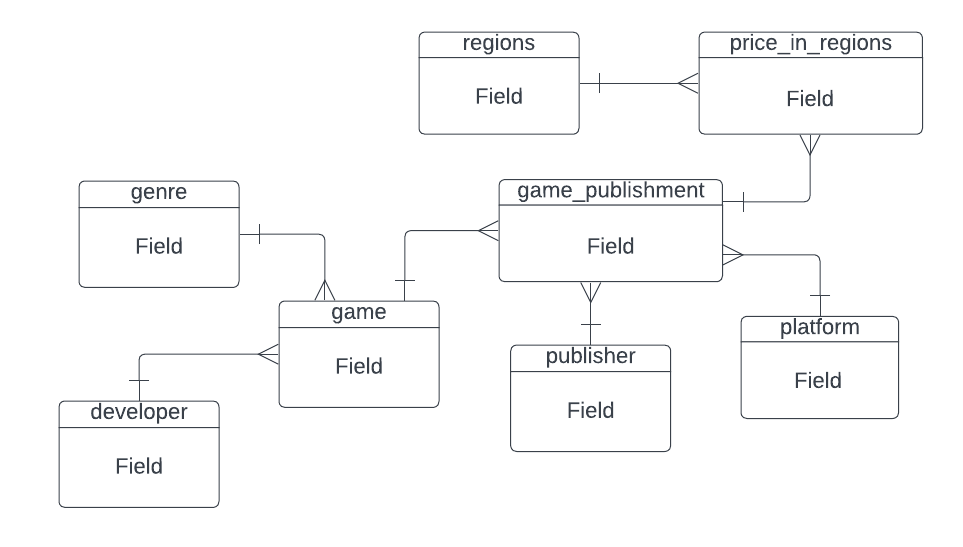
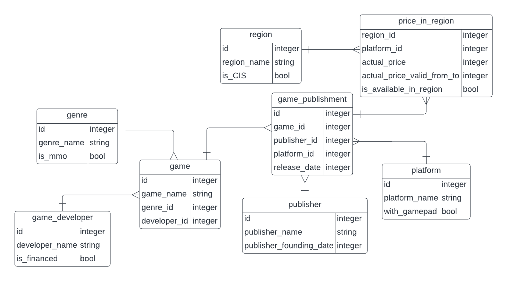

# Проект "Библиотека игр"

---

Имеется база данных игр, где можно посмотреть жанр этой игры, её разработчика, издания на разных плафтормах, а также цены на игру в зависимости от региона.

**Концептуальная модель**

**Логическая модель**

Итого мы имеем 9 сущностей: игра(game), жанр(genre), разработчик игры(game_developer), издание игры(game_publishment), издатель(publisher), платформа игры(game_platform), платформа(platform), цена в регионе(price_in_regions) и сами регионы(region).

* game - список всех игр в базе данных.
* genre - жанр игры, к примеру race, shooter или RPG.
* game_developer - разработчик или компания, которая разработала эту игру.
* game_publishment - это таблица, которая объединяет игру с их издателем на разных платформах, а также дату выхода самой игры. Оно отдельно, так как у игры может быть несколько издателей, к примеру на разных платформах бывают разные издатели (на PS и XBOX).
* publisher - компания-издатель.
* price_in_regions - таблица, связывающая цену на игру в зависимости от региона, а также текущую стоимость, которая дейстивтельна в какой-то промежуток времени, к примеру в разных регионах цена на игру может разительно отличаться.
* region - сами регионы.

Физическая модель: https://docs.google.com/spreadsheets/d/1MqTdy4tH9zqU_4J6k9Fl3vN7G20Ih7pEwptfPKqTOPs/edit?hl=ru#gid=0 (добавил возможность комментировать)
